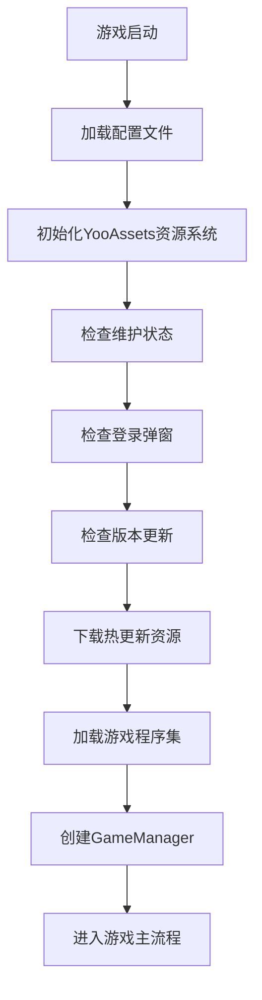
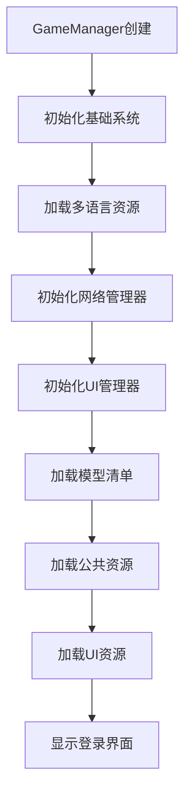
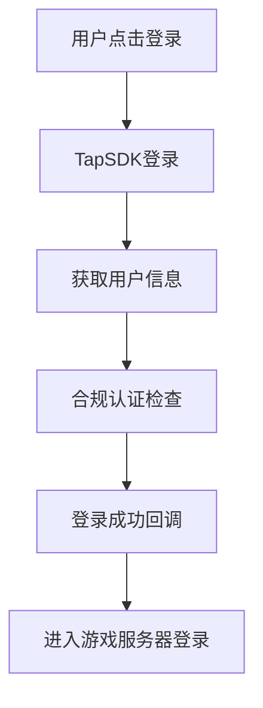
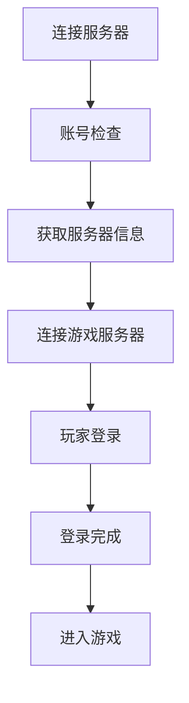
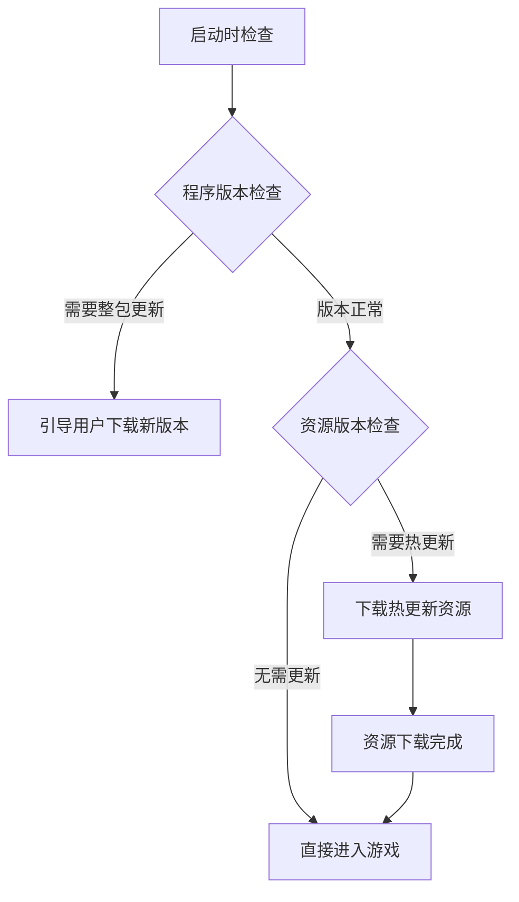

# 疯狂冒险家 (FengKuang MaoXianJia)

## 项目概述

疯狂冒险家是一款基于Unity引擎开发的跨平台游戏项目，支持Android、iOS、WebGL、微信小游戏、抖音小游戏等多个平台。项目采用模块化架构设计，集成了热更新、多语言、SDK集成等核心功能。

## 技术栈

- **游戏引擎**: Unity 2021.3.41f1
- **热更新框架**: HybridCLR v8.2.0
- **资源管理**: YooAssets
- **UI框架**: FairyGUI
- **网络通信**: 自定义网络层 + Protocol Buffers
- **第三方SDK**: TapSDK、微信SDK、抖音SDK
- **开发语言**: C#

## 项目架构

### 目录结构

```
Assets/
├── EngineLauncher/          # 游戏启动器
│   ├── ready.cs            # 主启动脚本
│   ├── ready.unity         # 启动场景
│   ├── CI.cs               # 平台接口封装
│   └── EngineLauncherResUI.cs # 启动器UI
├── Scripts/
│   ├── Manager/            # 管理器层
│   │   ├── GameManager.cs  # 游戏主管理器
│   │   ├── TapSDKManager.cs # TapSDK管理器
│   │   ├── NetManager.cs   # 网络管理器
│   │   ├── UIManager.cs    # UI管理器
│   │   ├── SoundManager.cs # 音频管理器
│   │   ├── DataManager.cs  # 数据管理器
│   │   └── ModelManager.cs # 模型管理器
│   ├── UIBase/             # UI基础层
│   ├── UICode/             # UI业务逻辑
│   ├── Net/                # 网络层
│   │   ├── MsgLogic/       # 消息逻辑
│   │   └── MsgProto/       # 协议定义
│   ├── Model/              # 数据模型层
│   ├── Config/             # 配置管理
│   ├── Util/               # 工具类
│   ├── Timer/              # 定时器系统
│   └── RedDotSystem/       # 红点系统
├── ThirdParty/
│   └── Wrapper/            # 第三方SDK包装层
│       ├── ThirdPartyWrapper.cs # 主包装器
│       ├── SDKInterface.cs # SDK接口
│       └── ExtensionsDefs.cs # 扩展定义
└── Resources/              # 内置资源
```

### 架构设计

项目采用分层架构设计，主要分为以下几层：

1. **启动层 (EngineLauncher)**: 负责游戏启动、资源更新、程序集加载
2. **管理器层 (Manager)**: 负责各个系统的管理和协调
3. **业务层 (UIBase/UICode)**: 负责具体的游戏业务逻辑
4. **数据层 (Model/Config)**: 负责数据模型和配置管理
5. **网络层 (Net)**: 负责网络通信和消息处理
6. **工具层 (Util/Timer)**: 提供通用工具和系统服务

## 启动流程

### 1. 游戏启动阶段 (ready.cs)



**详细步骤：**

1. **配置加载** (`LoadConf()`)
   - 从服务器获取游戏配置
   - 解析服务器信息、版本信息、维护时间等
   - 设置白名单、登录弹窗等配置

2. **资源系统初始化** (`StartStepByYooAssetsInitPackage()`)
   - 初始化YooAssets资源管理系统
   - 创建默认资源包
   - 根据平台选择不同的播放模式：
     - OfflinePlayMode: 离线模式
     - HostPlayMode: 主机模式（热更新）
     - WebPlayMode: Web模式

3. **版本检查** (`StartStepByUpdateRes()`)
   - 检查程序版本是否需要整包更新
   - 检查资源版本是否需要热更新
   - 处理版本更新提示和下载

4. **程序集加载** (`OnLoadGameAssembly()`)
   - 加载HybridCLR热更新程序集
   - 加载ThirdParty和Engine程序集
   - 处理程序集版本变更

5. **游戏管理器创建** (`GameManager.CreateNew()`)
   - 创建GameManager实例
   - 启动游戏主流程

### 2. 游戏初始化阶段 (GameManager.cs)



**详细步骤：**

1. **基础系统初始化**
   - 初始化FairyGUI UI框架
   - 设置UI配置和字体
   - 初始化版本管理器

2. **SDK初始化** (`SDKInterface.CreateNew()`)
   - 根据平台初始化相应的SDK
   - 初始化TapSDK等第三方服务

3. **资源加载**
   - 加载多语言资源
   - 加载模型清单
   - 加载公共资源
   - 加载UI包

4. **界面显示**
   - 显示登录界面
   - 注册事件监听

## 登录流程

### TapSDK登录流程



**详细步骤：**

1. **TapSDK登录** (`TapSDKManager.TapSDKLogin()`)
   - 调用TapTapLogin进行登录
   - 获取用户账号信息（openId、unionId等）

2. **合规认证** (`TapSDKManager.StartCheckCompliance()`)
   - 启动合规检查
   - 处理实名认证、年龄限制等
   - 支持宵禁、时长限制等功能

3. **游戏服务器登录**
   - 使用TapSDK获取的用户信息
   - 连接游戏服务器进行验证

### 游戏服务器登录流程



**详细步骤：**

1. **服务器连接** (`LoginCheckServer()`)
   - 连接大厅服务器
   - 发送账号检查请求

2. **账号验证** (`OnAccountCheck()`)
   - 验证用户账号
   - 获取游戏服务器信息（IP、端口、Token）

3. **游戏服务器登录** (`DoPlayerLogin()`)
   - 连接游戏服务器
   - 发送玩家登录请求

4. **登录完成** (`OnPlayerLogin()`)
   - 启动心跳机制
   - 进入游戏主界面

## 更新流程

### 版本更新检查



**详细步骤：**

1. **版本检查** (`StartStepByUpdateRes()`)
   - 检查程序版本
   - 检查资源版本
   - 处理不同渠道的更新策略

2. **资源下载** (`LoadSuitableResWithYooAssets()`)
   - 使用YooAssets下载资源
   - 显示下载进度
   - 处理下载错误和重试

3. **更新完成** (`OnUpdateResSuccess()`)
   - 加载游戏程序集
   - 进入游戏主流程

## 主要功能模块

### 1. 管理器系统

#### GameManager (游戏主管理器)
- 游戏主控制器
- 管理登录状态和流程
- 协调各个系统
- 处理场景切换

#### TapSDKManager (TapSDK管理器)
- TapSDK功能封装
- 登录、登出管理
- 合规认证处理
- 更新唤起功能
- 数据分析功能

#### NetManager (网络管理器)
- 网络连接管理
- 消息发送接收
- 心跳机制维护
- 断线重连处理

#### UIManager (UI管理器)
- UI界面管理
- 界面显示隐藏
- UI资源加载
- UI层级管理

#### SoundManager (音频管理器)
- 背景音乐管理
- 音效播放
- 音量控制
- 音频资源管理

### 2. 网络通信

#### 消息协议
- 使用Protocol Buffers定义消息格式
- 支持CS（客户端到服务器）和SC（服务器到客户端）消息
- 消息ID统一管理

#### 连接管理
- 支持TCP连接
- 心跳机制保持连接
- 断线重连功能
- 消息队列和重发机制

### 3. UI系统

#### FairyGUI集成
- 使用FairyGUI作为UI框架
- 支持UI包动态加载
- UI组件自动绑定
- 多语言文本支持

#### UI管理
- 界面层级管理
- 界面生命周期管理
- UI资源预加载
- 界面切换动画

### 4. 数据管理

#### 配置系统
- 支持Excel配置导入
- 配置热更新
- 多语言配置
- 服务器配置

#### 数据持久化
- 玩家数据本地存储
- 设置数据保存
- 缓存数据管理

### 5. 热更新系统

#### HybridCLR热更新
- 支持C#代码热更新
- AOT泛型补充
- 程序集元数据预加载
- 热更新程序集加载

#### YooAssets资源热更新
- 资源包管理
- 增量更新
- 资源版本控制
- 下载进度显示

## 平台支持

### 支持的平台
- **Android**: 原生Android应用
- **iOS**: 原生iOS应用
- **WebGL**: Web浏览器
- **微信小游戏**: 微信小程序平台
- **抖音小游戏**: 抖音小程序平台

### 平台特性
- 各平台SDK集成
- 平台特定功能适配
- 平台UI适配
- 平台性能优化

## 开发环境

### 环境要求
- Unity 2021.3.41f1
- .NET Framework 4.7.1
- Visual Studio 2019/2022
- Android Studio (Android开发)
- Xcode (iOS开发)

### 构建配置
- 支持Debug和Release构建
- 支持不同平台的构建配置
- 支持热更新和整包构建
- 支持渠道包构建

## 部署和发布

### 构建流程
1. 资源打包
2. 程序集编译
3. 热更新资源生成
4. 平台特定打包
5. 签名和优化

### 发布流程
1. 版本号管理
2. 资源上传
3. 配置更新
4. 平台发布
5. 监控和回滚

## 监控和调试

### 日志系统
- 分级日志输出
- 日志文件管理
- 远程日志收集
- 性能监控

### 调试工具
- 内置调试界面
- 网络消息调试
- 性能分析工具
- 内存监控

## 注意事项

1. **热更新限制**: 某些Unity API在热更新中不可用
2. **平台差异**: 不同平台的功能和性能存在差异
3. **SDK版本**: 需要定期更新第三方SDK版本
4. **合规要求**: 需要遵守各平台的合规要求
5. **性能优化**: 需要注意内存和性能优化

## 贡献指南

1. 遵循代码规范
2. 添加必要的注释
3. 进行充分的测试
4. 提交清晰的提交信息

## 许可证

本项目采用私有许可证，未经授权不得使用。
